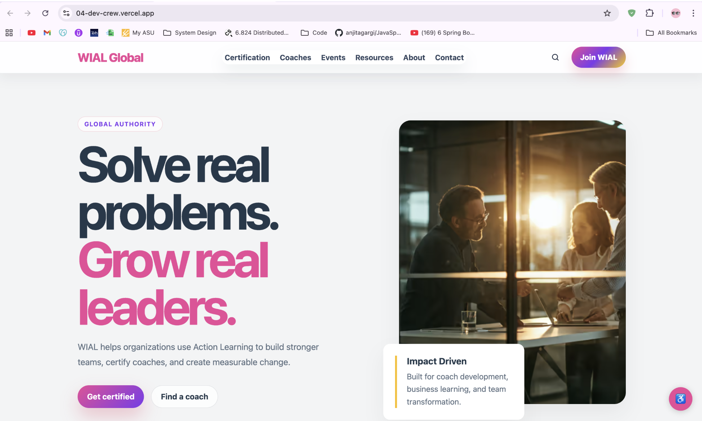
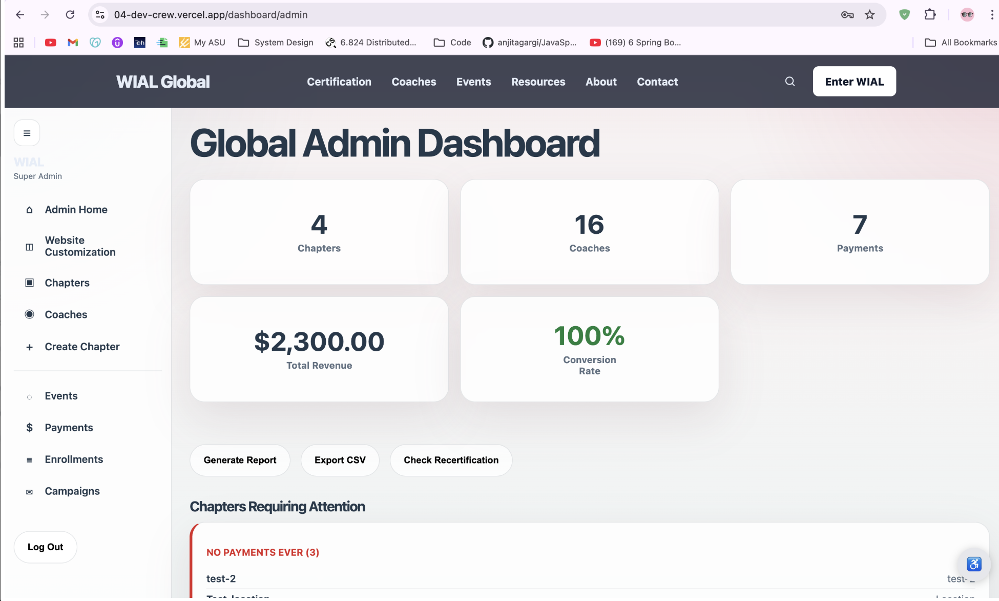
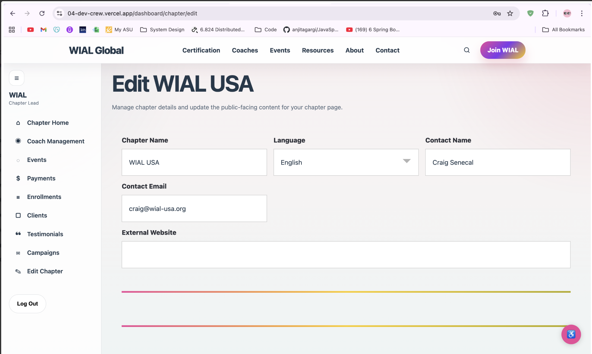
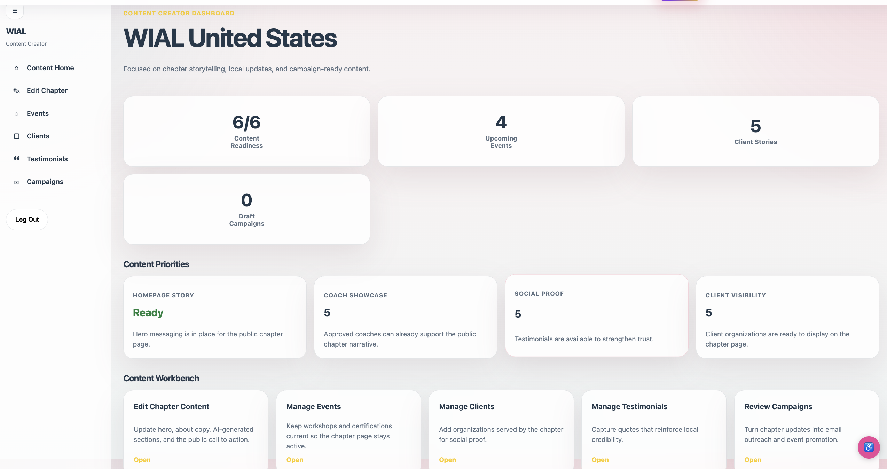
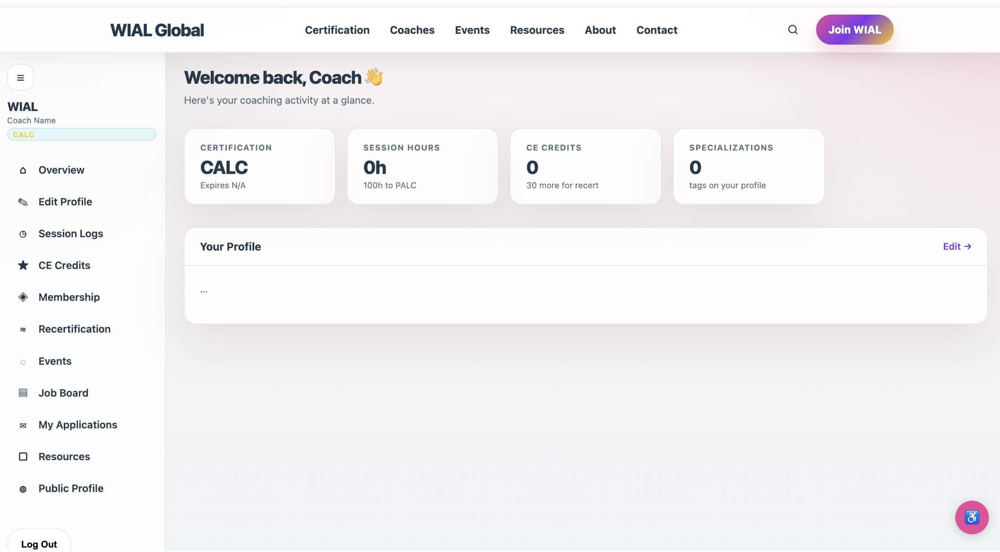

# WIAL Platform — Dev Crew

## Quick Links
- [Hackathon Details](https://www.ohack.dev/hack/2026_spring_wics_asu)
- [DevPost Submission](https://wics-ohack-sp26-hackathon.devpost.com/)
- [Team Slack Channel](https://opportunity-hack.slack.com/app_redirect?channel=team-04-dev-crew)

---

## Team "Dev Crew"
| Name | Role |
|---|---|
| Siya Singh | Team Member |
| Misha Kumari | Team Member |
| Abhinav Reja | Team Member |
| Neha Valeti | Team Member |

---

## Problem Statement

WIAL (World Institute for Action Learning) is a global nonprofit that certifies Action Learning coaches worldwide through 20+ country-level chapters. Every chapter currently runs its own independent WordPress site with inconsistent branding, no centralized coach directory, no payment system, and no way for WIAL Global to push updates.

Coaches in developing countries are effectively invisible — their chapter sites look unprofessional, load slowly on low-bandwidth connections, and cannot be found across language barriers.

---

## What We Built

A unified AI-native web platform where:
- **WIAL Global** manages all chapters from one dashboard
- **Chapter leads** create professional branded websites in 60 seconds using AI
- **Coaches** are discoverable worldwide through cross-lingual AI semantic search
- **Dues** are collected via Stripe
- **Pages load in under 4 seconds** on slow 3G — pre-built as static HTML

### Key AI Features
- **AI-1: Cross-Lingual Semantic Search** — Search for coaches in any language and find matches across all languages using OpenAI embeddings + Supabase pgvector
- **AI-2: Chapter-in-a-Box** — AI generates a full culturally-adapted chapter website in 60 seconds from a short form

---

## Tech Stack

| Layer | Technology |
|---|---|
| Framework | Next.js 14 (App Router, SSG) |
| Language | TypeScript |
| UI Components | shadcn/ui + Tailwind CSS |
| Database | Supabase (PostgreSQL + pgvector) |
| Auth | Supabase Auth (Google SSO + email/password) |
| File Storage | Supabase Storage |
| Payments | Stripe Checkout + Webhooks |
| AI Embeddings | OpenAI text-embedding-3-small |
| AI Content | OpenAI GPT-4o-mini |
| Vector Search | Supabase pgvector (cosine similarity) |
| Hosting | Vercel |
| Email | Resend |

---

## Live Demo

- **Deployed App:** _Coming soon_
- **Demo Video:** _Coming soon_
- **DevPost Project:** https://devpost.com/software/wial-platform 

---
## Screenshots

### Homepage


### Global Coach Directory


### Chapter Dashboard
 

### Content Creator Dashboard


### Coach Profile / Membership



## Getting Started

### Prerequisites
- Node.js 18+
- A Supabase project with pgvector enabled
- OpenAI API key
- Stripe account

### Setup

```bash
# 1. Clone the repo
git clone https://github.com/2026-ASU-WiCS-Opportunity-Hack/04-dev-crew.git
cd 04-dev-crew

# 2. Install dependencies
npm install

# 3. Set up environment variables
cp .env.example .env.local
# Fill in your keys in .env.local

# 4. Run the development server
npm run dev
```

Open [http://localhost:3000](http://localhost:3000) in your browser.

### Seed the Database

```bash
npm run seed
```

This inserts 4 chapters, 15 coaches with embeddings, 6 events, payments, testimonials, and clients.

---

## Git Workflow

```
main    ← always deployable, source of truth
  └── dev     ← integration branch, everyone merges here first
        ├── person1/backend
        ├── person2/frontend-shell
        ├── person3/chapters
        └── person4/coaches
```

- Branch off `dev` for your work
- PR into `dev` when your feature works
- `dev` → `main` once stable and tested
- **Never commit `.env.local`** — share credentials via DM

---

## Checklist for Final Submission

### 0/Judging Criteria
- [ ] Review the [judging criteria](https://www.ohack.dev/about/judges#judging-criteria) to understand how your project will be evaluated

### 1/DevPost
- [ ] Submit a [DevPost project to this DevPost page for our hackathon](https://wics-ohack-sp26-hackathon.devpost.com/) - see our [YouTube Walkthrough](https://youtu.be/rsAAd7LXMDE) or a more general one from DevPost [here](https://www.youtube.com/watch?v=vCa7QFFthfU)
- [ ] Your DevPost final submission demo video should be 4 minutes or less
- [ ] Link your team to your DevPost project on ohack.dev in [your team dashboard](https://www.ohack.dev/hack/2026_spring_wics_asu/manageteam)
- [ ] Link your GitHub repo to your DevPost project on the DevPost submission form under "Try it out" links

### 2/GitHub
- [ ] Add everyone on your team to your GitHub repo [YouTube Walkthrough](https://youtu.be/kHs0jOewVKI)
- [ ] Make sure your repo is public
- [ ] Make sure your repo has a MIT License
- [ ] Make sure your repo has a detailed README.md (see below for details)

### 2/GitHub
- [ ] Add everyone on your team to your GitHub repo [YouTube Walkthrough](https://youtu.be/kHs0jOewVKI)
- [ ] Make sure your repo is public
- [ ] Make sure your repo has a MIT License
- [ ] Make sure your repo has a detailed README.md (see below for details)
